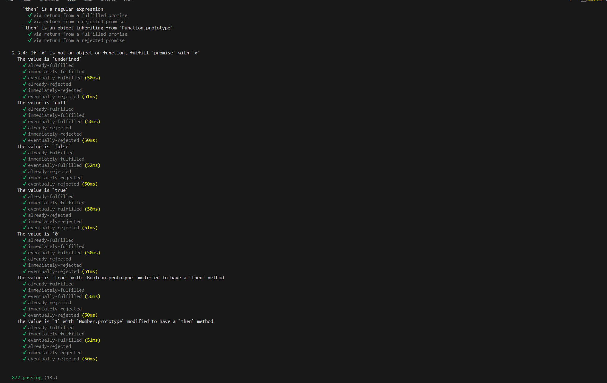

## 实现参考
[ECMA262 (27.2 Promise Objects)](https://262.ecma-international.org/#sec-promise-objects)

[Promise/A+规范](https://promisesaplus.com/)

## Promise/A+测试
运行以下命令
` pnpm run macho `

## 待实现
* Promise.all
* Promise.race
* promise.any